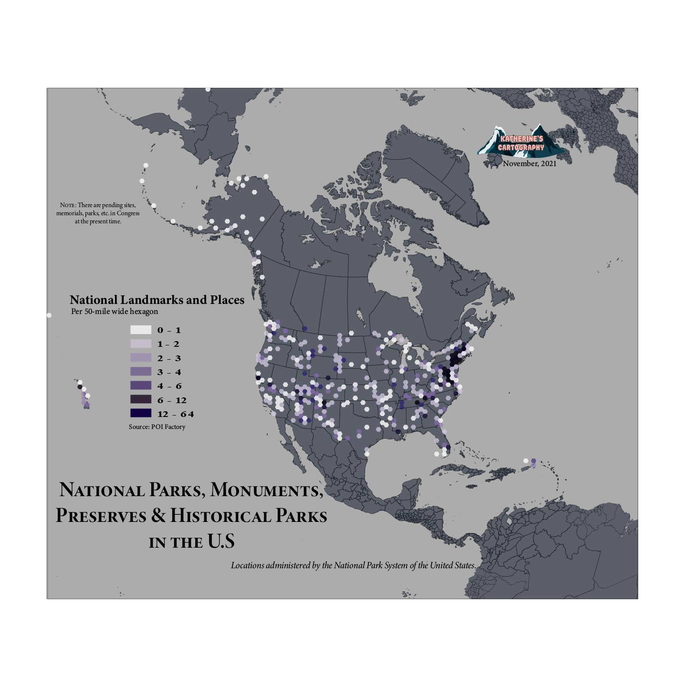

# National Landmarks and Places Throughout the U.S.

Thematic map of the National Parks, Monuments, Preserves, and Historical Parks in the United States.

[Download a PDF version](hexagon-map.pdf)

*Map made through QGIS, Adobe Illustrator, and Adobe Photoshop.*

https://laurensonmapping.github.io/national-landmarks-and-places/

